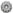

> **⚠️ UWAGA: Dopóki zestaw nie osiągnie stabilnej wersji (1.0.0) mogą pojawiać się błędy oraz zmiany podstawowych funkcjonalności ([Zgłaszanie Błędów](download.md#zgłaszanie-błędów))**

# Lista Dodatków

W tym rozdziale znajdują się wszystkie informacje na temat dodatków zestawu. Zanim jednak przejdziemy do szczegółowych opisów każdego z nich, zapoznajmy się z podstawowymi pojęciami.

### Przyciski Wewnątrz Managera
 - Przełącznik okna ustawień dodatku.

 - Przełącznik okna aktywnych ustawień dodatku.

<!-- TODO: Add link to on-error -->
📋 - Przycisk do kopiowania logów[^no-sensitive-info] z gry, potrzebnych przy [zgłaszaniu błędu]() w zestawie. Znajduje się w nagłówku **Konsola**.

[^no-sensitive-info]: Logi zawierają wyłącznie informacje na temat otoczenia bohatera oraz kod błędu.

### Okna Dodatków
Wewnątrz zestawu rozróżniane są dwa rodzaje okienek dodatków:
* okno ustawień,
* okno **aktywnych** ustawień.

**Okno ustawień dodatku** jest najczęściej tym bardziej rozbudowanym oraz zawiera w sobie wszystkie ustawienia dodatku, które nie muszą być natychmiastowo dostępne np. ustawianie skrótów klawiszowych. Okno ustawień można włączyć niezależnie od tego czy dodatek jest włączony, czy nie.

**Okno aktywnych ustawień dodatku** to miejsce na najważniejsze opcje dostępne w trakcie korzystania z dodatku. Okno aktywnych ustawień wyświetla się wtedy i tylko wtedy, gdy dodatek oraz okno aktywnych ustawień są włączone. Od okna ustawień różni się jeszcze tym, że (w zależności od dodatku) można zmieniać jego rozmiar.

<!-- TODO: Refactor -->
# Szukanie Dodatków
Jeżeli jesteś zainteresowany działaniem konkretnego dodatku zalecam wyszukać go za pomocą lupy (lewy górny róg ekranu).