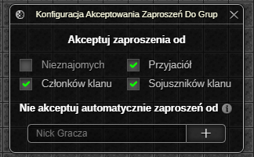
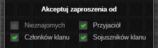
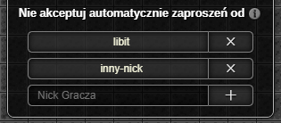

> **⚠️ UWAGA: Dopóki zestaw nie osiągnie stabilnej wersji (1.0.0) mogą pojawiać się błędy oraz zmiany podstawowych funkcjonalności ([Zgłaszanie Błędów](../../download.md#zgłaszanie-błędów))**
# Akceptowanie Zaproszeń Do Grupy 

Dodatek automatycznie akceptuje zaproszenia do grupy od określonych graczy.

# Okno Ustawień

#### Akceptuj zaproszenia od

Dodatek automatycznie zaakceptuje zaproszenia od gracza, jeżeli posiada on którąkolwiek z zaznaczonych relacji. W przeciwnym razie zaproszenie nie zostanie odrzucone.

#### Nie akceptuj automatycznie zaproszeń od

Jeżeli nick gracza wysyłającego zaproszenie znajduje się na liście wykluczeń, nie zostanie ono automatycznie zaakceptowane. Zamiast tego wybór będzie należał do bohatera.

*Ostatnia aktualizacja: 0.14.4*