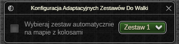
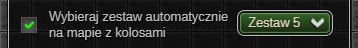

> **⚠️ UWAGA: Dopóki zestaw nie osiągnie stabilnej wersji (1.0.0) mogą pojawiać się błędy oraz zmiany podstawowych funkcjonalności ([Zgłaszanie Błędów](../../download.md#zgłaszanie-błędów))**
# Adaptacyjne Zestawy Do Walki
**🔒 *Ten dodatek jest dostępny wyłącznie w wersji Premium.* 🔒**

Dodatek automatycznie zmienia zestaw do walki w zależności od otoczenia.

# Okno Ustawień

#### Ustawienia ogólne

* Możliwość automatycznej zmiany zestawu do walki w zależności od tego czy w aktualnej lokacji, znajduje się potwór o randze kolos.

*Ostatnia aktualizacja: 0.14.4*