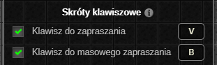
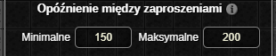
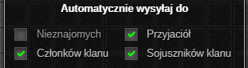
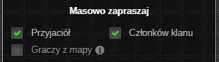
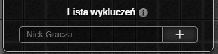
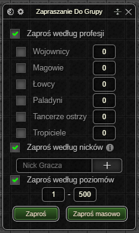

> **⚠️ UWAGA: Dopóki zestaw nie osiągnie stabilnej wersji (1.0.0) mogą pojawiać się błędy oraz zmiany podstawowych funkcjonalności ([Zgłaszanie Błędów](../../download.md#zgłaszanie-błędów))**
# Zapraszanie Do Grupy
**🔒 *Ten dodatek jest dostępny wyłącznie w wersji Premium.* 🔒**

Rozbudowane automatyczne wysyłanie zaproszeń do grup.

# Okno Ustawień

#### Skróty klawiszowe

* Klawisz do zapraszania odpowiada za zapraszanie graczy znajdujących się w tej samej lokacji co bohater według relacji wybranych w zakładce [automatycznie wysyłaj do](#automatycznie-wysyłaj-do).
* Klawisz do masowego zapraszania odpowiada za zapraszanie członków klanu, przyjaciół oraz graczy znajdujących się w tej samej lokacji co bohater.
  * Podczas masowego zapraszania graczy na tej samej mapie co bohater pod uwage brane są ustawienia z zakładki [automatycznie wysyłaj do](#automatycznie-wysyłaj-do).

#### Opóźnienie między zaproszeniami

Opóźnienie między zaproszeniami określa zakres czasowy w milisekundach między wysyłaniem zaproszeń do grupy.

#### Automatycznie wysyłaj do

Lista relacji uwzględniana podczas zapraszania oraz masowego zapraszania (graczy z mapy) za pomocą dodatku.

#### Masowo zapraszaj

Lista relacji uwzględniana podczas masowego zapraszania za pomocą dodatku.

#### Lista wykluczeń

Jeżeli nick gracza znajduje się na liście wykluczeń, zaproszenie nie zostanie do niego wysłane.

# Okno Aktywnych Ustawień

Ustawienia z tego okna są uwzględniane wyłącznie podczas zapraszania za pomocą przycisków **Zaproś** lub **Zaproś masowo**.

- Możliwość zapraszania graczy według profesji.
  - Filtrowanie graczy z listy kandydatów na podstawie obecnego stanu grupy oraz **wszystkich włączonych** filtrów profesji. Jeżeli filtr jest wyłączony żaden gracz o danej profesji nie zostanie zaproszony.
- Możliwość zapraszania graczy według nicków.
- Możliwość zapraszania graczy według poziomów.

<em>Ostatnia aktualizacja: 0.14.4</em>
