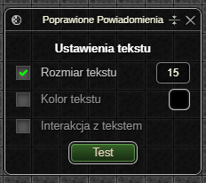
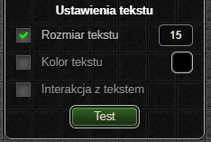

> **⚠️ UWAGA: Dopóki zestaw nie osiągnie stabilnej wersji (1.0.0) mogą pojawiać się błędy oraz zmiany podstawowych funkcjonalności ([Zgłaszanie Błędów](../../download.md#zgłaszanie-błędów))**
# Poprawione Powiadomienia
Dodatek umożliwia zmianę wyglądu żółtych wiadomości z gry, wyświetlanych np. przy wbiciu poziomu.

# Okno Aktywnych Ustawień

#### Ustawienia tekstu

* Wybór rozmiaru tekstu.
* Wybór koloru tekstu.
* Wybór interakcji z tekstem - po włączeniu konieczne jest zamknięcie wiadomości, aby móc kliknąć elementy pod nią.

*Ostatnia aktualizacja: 0.14.4*