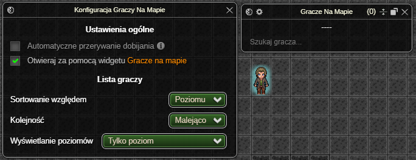
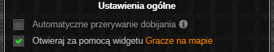
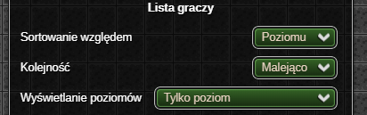
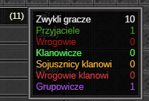
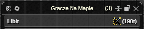
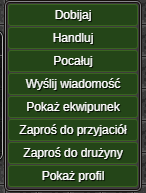
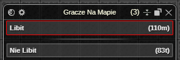
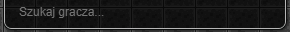

> **⚠️ UWAGA: Dopóki zestaw nie osiągnie stabilnej wersji (1.0.0) mogą pojawiać się błędy oraz zmiany podstawowych funkcjonalności ([Zgłaszanie Błędów](../../download.md#zgłaszanie-błędów))**
# Gracze Na Mapie

Dodatek wyświetla listę graczy znajdujących się w aktualnej lokacji, umożliwiając interakcje z każdym z nich.

# Okno Ustawień

#### Ustawienia ogólne

* **🔒 Funkcja Premium 🔒** Możliwość automatycznego przerwania dobijania gracza, w przypadku:
    * zmiany trasy przez bohatera przed dotarciem do celu,
    * opuszczenia przez cel zasięgu ataku.
* 

Możliwość otwierania okna aktywnych ustawień za pomocą wbudowanego do gry widgetu Gracze na mapie.

#### Lista graczy

* Dostępne opcje sortowania listy to sortowanie względem:
  * poziomu - w przypadku takiego samego poziomu gracze sortowani są alfabetycznie,
  * nicku,
  * profesji - sortowanie dzieli listę na grupy profesji, które ustawiane są w zależności od **liczby graczy o danej profesji**. Wewnątrz poszczególnych grup gracze sortowani są malejąco według poziomu, następnie alfabetycznie według nicku.
* Kolejność sortowania pozwala wybrać "kierunek" sortowania - malejący lub rosnący.
* Wyświetlanie poziomów określa w jaki sposób wyświetlać poziomy graczy z listy. Dostępne opcje to: 
  * Poziom | Poziom operacyjny
  * Poziom operacyjny | Poziom
  * Tylko poziom operacyjny
  * Tylko poziom

# Okno Aktywnych Ustawień

#### Licznik graczy

Po najechaniu na licznik graczy myszką wyświetlana jest szczegółowa lista relacji graczy znajdujących się w bieżącej lokacji. Ze względu na mechanikę gry, jeżeli gracz jest jednocześnie np. przyjacielem oraz klanowiczem pod uwagę będzie brana tylko *ważniejsza*[^note] relacja.

[^note]: W planach i tak jest obejście więc nie bd tego tłumaczył jo.

#### Lista graczy
Tabela z graczami znajdującymi się w aktualnej lokacji, w zawartość pojedynczej komórki gracza wchodzą:

* nick,
* lista okazywanych aktualnie emocji,
* poziom,
* profesja.

Kolor komórki gracza zależy od jego relacji względem bohatera. Jeśli jednak należy on do tej samej grupy co bohater, wyświetlany jest kolor grupowy.
Dodatkowe informacje wyświetlane po najechaniu myszką to m.in. nazwa klanu i outfit.

Po dwukliku LPM na komórkę gracza, bohater automatycznie do niego podejdzie.

Po kliknięciu PPM na komórkę gracza dostępne jest menu kontekstowe w skład którego wchodzą opcje:

* **🔒 Funkcja Premium 🔒** `Dobijaj` - wyznacza gracza na cel:
  * po wybraniu tej opcji bohater podejdzie do celu i będzie go atakować, dopóki m.in. przeciwnik się nie teleportuje lub nie rozpocznie się walka.
* **✅ Funkcja Non-Premium ✅** `Atakuj` - wyznacza gracza na cel (działa tak samo jak opcja z gry).
* `Handluj` - podchodzi do gracza oraz wysyła żądanie handlu.
* `Pocałuj` - całuje gracza (dostępne od 30 poziomu doświadczenia).
* `Karmazynowe błogosławieństwo` - podchodzi do gracza oraz rzuca na niego karmazynowe błogosławieństwo.
* `Wyślij wiadomość` - rozpoczyna proces wysyłania wiadomości prywatnej do gracza (dostępne jeżeli gracz nie jest wrogiem bohatera).
* `Pokaż ekwipunek` - otwiera okno z ekwipunkiem gracza.
* `Zaproś do przyjaciół` - zaprasza gracza do przyjaciół.
* `Zaproś do drużyny` - zaprasza gracza do drużyny.
* `Pokaż profil` - otwiera okno z profilem gracza.

Po wybraniu gracza jako celu ataku, zostaje on automatycznie przeniesiony na szczyt listy graczy.

W takiej sytuacji – a także po najechaniu kursorem na jego komórkę lub kliknięciu jej PPM – pojawia się strzałka wskazująca jego pozycję. Dodatkowo gracz-cel renderowany jest nad wszystkimi obiektami na mapie i otoczony wyraźną ramką.

#### Wyszukiwarka graczy

Wyszukiwarka u dołu listy umożliwia filtrowanie graczy po nicku.

*Ostatnia aktualizacja: 0.14.4*