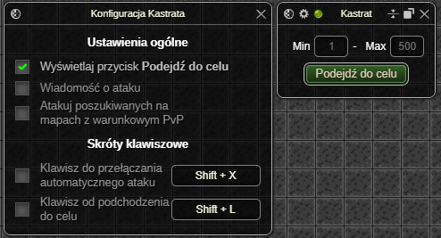
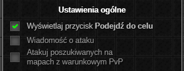
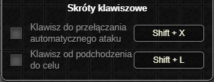
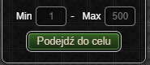

> **⚠️ UWAGA: Dopóki zestaw nie osiągnie stabilnej wersji (1.0.0) mogą pojawiać się błędy oraz zmiany podstawowych funkcjonalności ([Zgłaszanie Błędów](../../download.md#zgłaszanie-błędów))**
# Kastrat
**🔒 *Ten dodatek jest dostępny wyłącznie w wersji Premium.* 🔒**

Potocznie nazywany *Auto X*. Dodatek służy gonieniu i automatycznemu atakowaniu graczy, wybieranych na podstawie określonych przez użytkownika kryteriów.

W przeciwieństwie do wszystkich *Auto X*-ów na rynku, **Kastrat** działa w oparciu o [analizę otoczenia bohatera](https://quickbirdstudios.com/blog/what-is-functional-reactive-programming-frp/), co znacząco zmniejsza ilość zużywanych zasobów.
Dzięki niestandardowej metodzie ataku, potrafi działać nawet o **33%–50% szybciej** (w zależności od interfejsu), skuteczniej wyłapując graczy niż jakiekolwiek inne rozwiązania.
> **INFO:** Uruchomienie wielu *Auto X*-ów jednocześnie nie zwiększy skuteczności żadnego z nich!

# Okno Ustawień

#### Ustawienia ogólne

* Przełącznik wyświetlania przycisku **Podejdź do celu**.
* Przełącznik wyświetlania wiadomości podczas wysłania żądania ataku do aktualnego celu.
* Opcjonalne atakowanie graczy poszukiwanych listem gończym na mapach z warunkowym PvP.

#### Skróty klawiszowe

Wewnątrz dodatku dostępne są również dwa skróty klawiszowe:

* włączanie/wyłączanie automatycznego atakowania celu,
* podejście do aktualnego celu.

# Okno Aktywnych Ustawień

#### Ustawienia ogólne

* Zakres poziomowy, z którego wybierany jest aktualny cel.
* Przycisk **Podejdź do celu**.

*Ostatnia aktualizacja: 0.14.4*