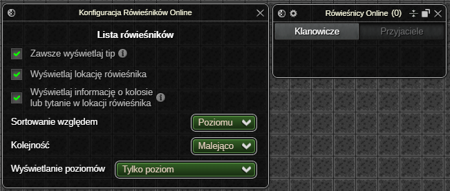
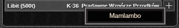
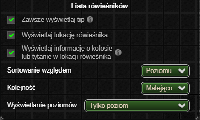
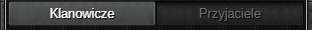
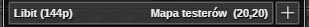
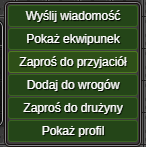

> **⚠️ UWAGA: Dopóki zestaw nie osiągnie stabilnej wersji (1.0.0) mogą pojawiać się błędy oraz zmiany podstawowych funkcjonalności ([Zgłaszanie Błędów](../../download.md#zgłaszanie-błędów))**
# Rówieśnicy Online
Dodatek wyświetla listę rówieśników online - klanowiczy lub przyjaciół, umożliwiając interakcje z każdym z nich.

Status aktywności rówieśników aktualizuje się automatycznie[^status-updates], w przeciwieństwie do ich pozycji. W celu ograniczenia ilości zapytań wysyłanych przez dodatki zestawu, obecnie jedynym sposobem na odświeżenie pozycji rówieśników jest **ręczne [odświeżenie listy](#odświeżanie-listy)**.

[^status-updates]: Automatycznie - od razu po zalogowaniu lub wylogowaniu gracza bez konieczności wysyłania zapytań do serwera gry.

Wyjątek stanowi sytuacja, gdy rówieśnik znajduje się na tej samej mapie co bohater – wtedy jego pozycja aktualizowana jest na bieżąco[^pos-update].

[^pos-update]: Dokładna pozycja (wraz z koordynatami) aktualizuje się przy każdym kroku rówieśnika. Jeżeli rówieśnik opuści mapę, zapisana pozycja zostaje usunięta (bohater nie wie gdzie znajduje się rówieśnik, aż do odświeżenia listy).

Dzięki innowacyjnym rozwiązaniom, dodatek oferuje niespotykany nigdzie indziej zestaw interakcji z rówieśnikami — w tym podgląd profilu gracza bezpośrednio w interfejsie gry!

# Okno Ustawień

#### Lista rówieśników

* Przełącznik pozwalający wybrać, czy tip rówieśnika ma być wyświetlany zawsze po najechaniu myszką na jego komórkę, czy tylko wtedy, gdy jego opis nie mieści się w oknie.
* Opcjonalne wyświetlanie lokacji rówieśników.
* Opcjonalne wyświetlanie informacji o kolosie lub tytanie w lokacji rówieśnika.

* Dostępne opcje sortowania listy to sortowanie względem:
  * poziomu - w przypadku takiego samego poziomu gracze sortowani są alfabetycznie,
  * nicku,
  * profesji - sortowanie dzieli listę na grupy profesji, które ustawiane są w zależności od **ilości graczy o danej profesji**. Wewnątrz poszczególnych grup gracze sortowani są malejąco według poziomu, następnie alfabetycznie według nicku.
* Kolejność sortowania pozwala wybrać "kierunek" sortowania - malejący lub rosnący.
* Wyświetlanie poziomów określa w jaki sposób wyświetlać poziomy graczy z listy. Dostępne opcje to: 
  * Poziom | Poziom operacyjny
  * Poziom operacyjny | Poziom
  * Tylko poziom operacyjny
  * Tylko poziom

# Okno Aktywnych Ustawień
#### Zakładki relacji

Panel zakładek relacji umożliwia przełączanie pomiędzy listą klanowiczów a listą przyjaciół aktualnie będących online.

#### Lista rówieśników
Tabela z rówieśnikami wyświetla listę klanowiczy lub przyjaciół online w zależności od wybranej zakładki. W zawartość pojedynczej komórki rówieśnika wchodzą:

* nick,
* poziom,
* profesja,
* mapa na której znajduje się gracz,
* koordynaty, jeżeli gracz znajduje się na tej samej mapie co bohater,
* przycisk **+** umożliwiający zaproszenie do grupy.

Dodatkowe informacje wyświetlane po najechaniu myszką to m.in. nazwa klanu i outfit.

Jeśli rówieśnik znajduje się na tej samej mapie co bohater, po dwukliku LPM na jego komórkę w liście, bohater automatycznie do niego podejdzie.

Po kliknięciu PPM na komórkę rówieśnika dostępne jest menu kontekstowe w skład którego wchodzą opcje:

* `Wyślij wiadomość` - rozpoczyna proces wysyłania wiadomości prywatnej do gracza (dostępne jeżeli gracz nie jest wrogiem bohatera).
* `Pokaż ekwipunek` - otwiera okno z ekwipunkiem gracza.
* `Zaproś do przyjaciół` - zaprasza gracza do przyjaciół.
* `Dodaj do wrogów` - dodaje gracza do listy wrogów.
* `Zaproś do drużyny` - zaprasza gracza do drużyny.
* `Pokaż profil` - otwiera okno z profilem gracza.

Jeśli rówieśnik znajduje się na tej samej mapie co bohater, po najechaniu kursorem na jego komórkę lub kliknięciu jej PPM – pojawia się strzałka wskazująca jego pozycję. Dodatkowo gracz-cel renderowany jest nad wszystkimi obiektami na mapie i otoczony wyraźną ramką.

#### Odświeżanie listy

<video controls autoplay muted loop playsinline width="400" class="right">
  <source src="images/list-refresh.mp4" type="video/mp4">
  Odświeżanie listy.
</video>

Mechanizm odświeżania pozycji rówieśników w liście działa w sposób znany z aplikacji mobilnych: przewiń listę maksymalnie do góry, a następnie pojawi się ikona, po przeciągnięciu której lista zostanie zaktualizowana.

<em>Ostatnia aktualizacja: 0.14.4</em>
