> **⚠️ UWAGA: Dopóki zestaw nie osiągnie stabilnej wersji (1.0.0) mogą pojawiać się błędy oraz zmiany podstawowych funkcjonalności ([Zgłaszanie Błędów](../../download.md#zgłaszanie-błędów))**
# Super Rzemieślnik

Dodatek umożliwia wykorzystanie przedmiotów z łupu lub ekwipunku jako składników do ulepszania.

* Automatyczne ulepszanie przedmiotów umieszczonych w oknie dodatku przy użyciu wybranych typów łupów z potworów.
* Przycisk **Ulepsz** umożliwiający ulepszanie przedmiotami z ekwipunku bohatera o rzadkości wyższej niż pospolita.

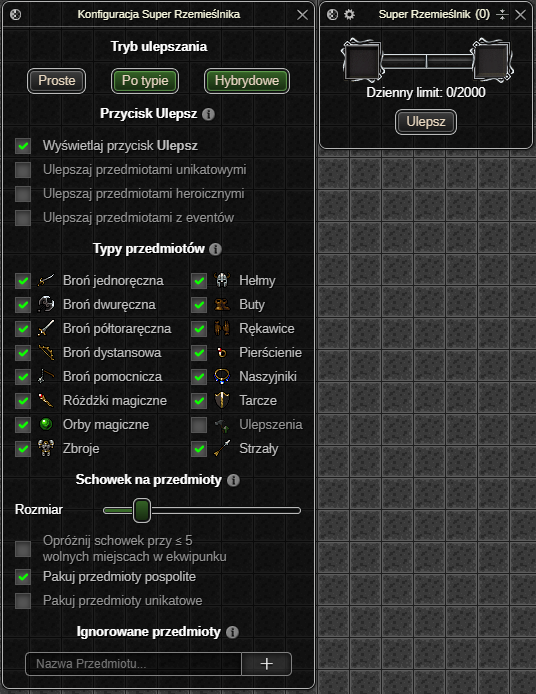

# Okno Ustawień

#### Tryb ulepszania

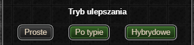

- `Proste` – ulepszanie jednego przedmiotu umieszczonego w oknie dodatku.  
  - Przedmiot zostanie ulepszony wszystkimi typami przedmiotów wybranymi przez gracza.  
- `Po typie` – ulepszanie do **3 przedmiotów** osadzonych w oknie dodatku (licząc od lewej):  
  1. **Pancerze** – ulepszane wybranymi przez gracza pancerzami.  
  2. **Biżuteria** – ulepszana wybraną przez gracza biżuterią.  
  3. **Broń** – ulepszana wybraną przez gracza bronią.  
- `Hybrydowe` – połączenie dwóch poprzednich trybów.  
  - Jeśli którekolwiek z pól z trybu `Po typie` jest puste, pozostałe typy przedmiotów zostaną użyte do ulepszania przedmiotu z pola trybu `Proste`.

#### Przycisk Ulepsz
Dokładne działanie przycisku opisane jest [tutaj](#przycisk-ulepsz-1).

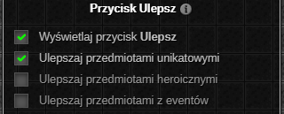

* Przełącznik wyświetlania przycisku wewnątrz [okna aktywnych ustawień](#okno-aktywnych-ustawień).
* Przełącznik ulepszania przedmiotami unikatowymi.
* Przełącznik ulepszania przedmiotami heroicznymi.
* Przełącznik ulepszania przedmiotami z eventów.

#### Typy przedmiotów

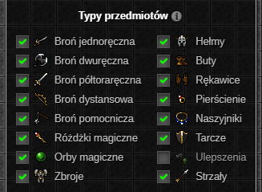

Lista przełączników rodzajów przedmiotów spalanych podczas ulepszania za pomocą dodatku.

Typ `Ulepszenia` zużywa wyłącznie ulepszenia o rzadkości pospolitej, unikatowej oraz heroicznej.

*Kołczany są zapisane jako strzały, tak samo jest w oknie rzemiosła z gry (?)*
<h4 id="schowek-na-przedmioty" style="clear: both; padding-top: 20px;"><a class="header" href="#schowek-na-przedmioty">Schowek na przedmioty</a></h4>

Łup z potworów spełniający aktualne kryteria zostaje przechowany w schowku. Przedmioty z łupu zostaną wykorzystane do ulepszania po jego zapełnieniu.

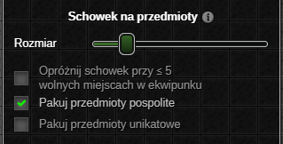

* Suwak umożliwiający wybranie rozmiaru schowka
  * Jeżeli opcja `Opróżnij schowek przy  ≤ x miejscach w ekwipunku` jest włączona, to rozmiar schowka jest aktualizowany dynamicznie na podstawie wolnych miejsc w ekwipunku bohatera.
* Możliwość pakowania przedmiotów pospolitych do schowka.
* Możliwość pakowania przedmiotów unikatowych (z wyłączeniem przedmiotów z eventów) do schowka.

#### Ignorowane przedmioty

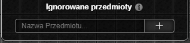

Jeśli nazwa przedmiotu zawiera którekolwiek z wyrażeń z tej listy, nie zostanie on umieszczony w schowku ani zużyty podczas ulepszania za pomocą przycisku **Ulepsz**.

# Okno Aktywnych Ustawień

#### Stan schowka

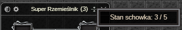

Wewnątrz górnej belki okna wyświetlany jest aktualny stan zapełnienia schowka.

#### Pola na przedmioty

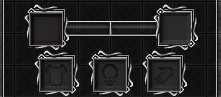

Pod górną belką okna wyświetlane są pola na przedmioty przeznaczone do ulepszania. Wyświetlane pola różnią się w zależności od wybranego [trybu ulepszania](#tryb-ulepszania).

#### Dzienny limit

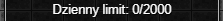

Dzienny limit oznacza ilość spalonych dzisiaj przedmiotów (max 2000). Przedmioty o typie *Ulepszenia* nie są wliczane w ten limit[^limit].

[^limit]: Teorytycznie nie są, ale gra zwraca informacje jakby były. Ostatecznie liczba może wynieść więcej niż 2000.

#### Przycisk Ulepsz

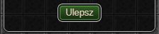

Przycisk **Ulepsz**, umożliwia ulepszanie przedmiotami o rzadkości wyższej niż pospolita. W procesie ulepszania brane są pod uwagę jedynie przedmioty znajdujące się w ekwipunku bohatera, które należą do typów określonych w zakładce [Typy przedmiotów](#typy-przedmiotów).

# Przykład działania dodatku

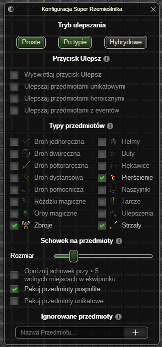

Jeżeli mamy włączone ulepszanie `Hybrydowe`, a użytkownik wybrał typy przedmiotów: *Zbroje*, *Pierścienie* i *Strzały*, to przy ulepszaniu przedmiotu w polu na `Pancerze` i przedmiotu w polu na ulepszanie `Proste`, działanie dodatku będzie wyglądało następująco:

*Bohater zdobywa łup z potworów*
1. Schowek zapełnia się łupami, które spełniają powyższe kryteria.
2. Następuje zatrzymanie bohatera - jest to wymagane do pomyślnego ulepszenia przedmiotów.
3. Schowek zostaje opróżniony z łupów typu *Zbroje*, zostają one zużyte do ulepszenia przedmiotu w polu na `Pancerze`.
4. Schowek zostaje opróżniony z łupów typu *Pierścienie* i *Strzały*, zostają one zużyte do ulepszenia przedmiotu w polu na ulepszanie `Proste`.
5. Po pomyślnym ulepszeniu ruch bohatera zostaje odblokowany.
6. Jeżeli którykolwiek z ulepszanych przedmiotów został maksymalnie ulepszony, jego slot zostaje odpowiednio zwolniony.

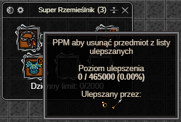

<em>Ostatnia aktualizacja: 0.14.4</em>
