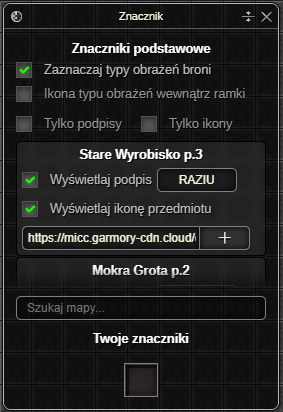
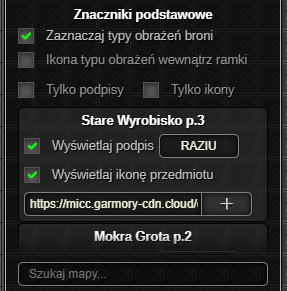
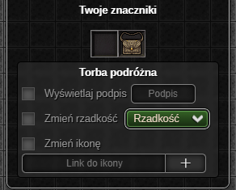

> **⚠️ UWAGA: Dopóki zestaw nie osiągnie stabilnej wersji (1.0.0) mogą pojawiać się błędy oraz zmiany podstawowych funkcjonalności ([Zgłaszanie Błędów](../../download.md#zgłaszanie-błędów))**
# Znacznik

Dodatek umożliwia konfigurowanie ikon oraz podpisów przedmiotów z gry.

- Aliasy lokacji oraz ikony potworów nad przedmiotami z kategorii `custom_teleport`.
- Ikony typów obrażeń broni.
- Edytowanie ikon, podpisów oraz rzadkości przedmiotów bohatera.

# Okno Aktywnych Ustawień

#### Znaczniki podstawowe

* Przełącznik ikon typów obrażeń broni.
    * Opcjonalne wyświetlanie znacznika wewnątrz ramki.
* Przełączniki umożliwiające wyświetlanie wyłącznie podpisów lub ikon potworów wewnątrz znaczników podstawowych.
* Lista znaczników podstawowych. Wewnątrz pojedynczej komórki znajdują się:
    * Przełącznik wyświetlania podpisu wraz z konfiguracją tekstu.
    * Przełącznik wyświetlania ikony wraz z konfiguracją linku do obrazka.
* Wyszukiwarka znaczników podstawowych spośród listy.

#### Twoje znaczniki

Znaczniki własne umożliwiają zmianę rzadkości, ikony oraz tekstu nad dowolnym przedmiotem bohatera.

* Przełącznik wyświetlania podpisu wraz z konfiguracją tekstu.
* Przełącznik wyświetlanej rzadkości.
* Przełącznik wyświetlania ikony wraz z konfiguracją linku do obrazka.

<em>Ostatnia aktualizacja: 0.14.4</em>
