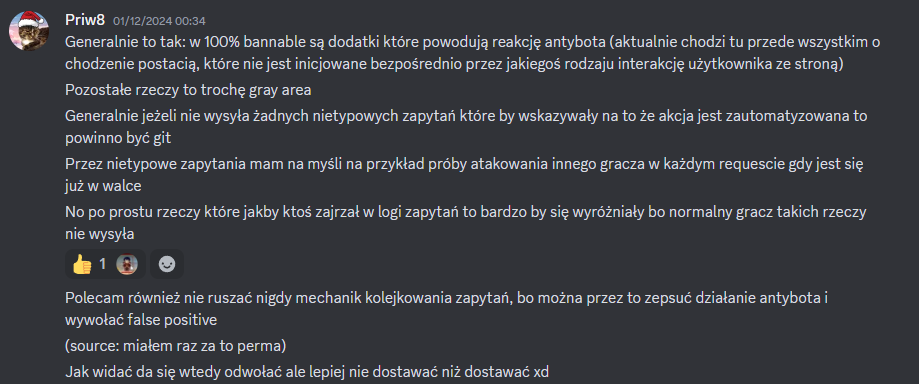

# Legalność Zestawu

~ Priv8 autor [Gargonem](https://gargonem.margoworld.pl), [MargoWorld](https://margoworld.pl).

Żadna z funkcji zestawu *Multipurpose Discord to Margonem Addons* __nie wywołuje reakcji antybota ani nie wysyła nietypowych zapytań__.

Mechanizm kolejkowania zapytań wewnątrz gry pozostaje nienaruszony. MDMA posiada własną kolejkę, która jest uwzględniana tylko wtedy, gdy kolejka gry jest pusta.

Zestaw nie przechowuje również żadnych danych wewnątrz obiektów globalnych takich jak `window`, czy też `localStorage`. Dodatkowo każdy element DOM zestawu jest renderowany wewnątrz shadow DOM co czyni go niewykrywalnym z poziomu kodu JS, w tym kodu gry.

# Czy Dostanę Bana?

Nie, jeżeli korzystasz wyłącznie z MDMA. Zestaw jest w pełni niewykrywalny przez antybota i o ile nie korzystasz z innych skryptów twoje konto nie zostanie zbanowane za dodatki.